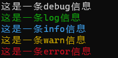
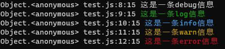

# 一个用于在nodejs中美化日志输出的工具

下面是一个预览图



## 1. 安装

```shell
npm install crlog
```

## 2. 使用

```typescript
import Log from "crlog";

Log.debug('这是一条debug信息');
Log.log('这是一条log信息');
Log.info('这是一条info信息');
Log.warn('这是一条warn信息');
Log.error('这是一条error信息');
```

然后你就会看到这样的输出效果：


 
## 3. 配置

* 如果希望输出日志的时候显示堆栈信息，可以设置`showStack`为`true`，默认为`false`
* 为了堆栈信息，我们在此只显示调用处的文件名和行号等信息。

```typescript
import Log from "crlog";
Log.showStack = true;
```

然后你看到的效果就是这样的：



 
